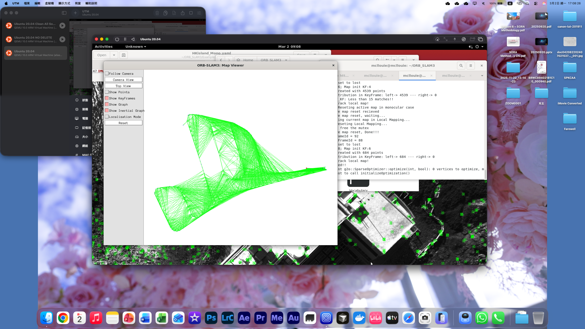

# AAE5303 Individual Report on Six Qualitative Indicators

## 1. Metadata

| Item | Details |
|---|---|
| Course | AAE5303 |
| Report type | Individual Report on Six Qualitative Indicators |
| Student name | MAN Chi Lok Louie |
| Student ID | 25001004G |
| Team name / group number | 我們組 (WMZ) |
| Team repo URL | https://github.com/mcllouie/AAE5303_Final-project_--WMZ |
| My role in the team | Visual SLAM and Coordinator |
| My primary module | [VSLAM / ~~3D reconstruction / segmentation / integration~~ / benchmarking / other] |
| Main dataset / scene used | AMtown02 |
| Main tools used | ~~Cursor / Docker~~ / ROS / ORB-SLAM3 / ~~OpenSplat / U-Net~~ / others |
| Main evidence paths | https://github.com/mcllouie/AAE5303-Group_Project-WMZ-VO |
| ~~Commit hash(es) / issue / notebook~~ / slide links | https://mcllouie.github.io/AAE5303-Group_Project-WMZ_Slides/ |
| Declared AI use | Google Ai Replies and Gemini |

---

## 2. Individual Contribution Statement

| Item | Content |
|---|---|
| Team result | Using AMtown02 as the dataset to "play" with the tools |
| My specific role | ORB-SLAM3 |
| My strongest evidence | Using completly MacOS with Apple Silicon to complete the Visual SLAM |
| My main learning focus | How **NOT** to follow pre-defined workflow to obtain the same result |

---

## 3. Project Snapshot

### 3.1 Project goal
To complete the 3 pipelines using the AMtown02 dataset, with the below challenges:
1.  Stubborn guy on using ARM Mac (i.e. no bootcamp) for completing visual SLAM.
2.  TAs had shut down the server **JUST BEFORE REPORT DATE** without prior notification, that computing 3DGS with notebook computers is an issue.
3.  U-Net have given a complete guide, but without hands-on.

Anyways, we successfully completed.

### 3.2 Pipeline overview
Since the dataset (AMtown02) was given by HKU MaRS Lab, we are able to perform 3 pipelines at the same time.  The pipeline for VO mainly follows the instructions and experiences from assignemnt 2.  3DGS was originally planned to use the server providede by TAs, yet it is shut off **JUST BEFORE REPORT DATE**, then Yuhao have to complete it locally.  For segmentation, its Bailin's specialties that he could complete the task swiftly.

### 3.3 My position in the pipeline
My position is Visual SLAM.  That I have to ensure the ouput, the python scripts to be exact, can generate the same format as windows user.  In other words, I have to build the same environment as the docker image provided.  Details will be discussed below.

### 3.4 Reproducibility snapshot
| Item | Details |
|---|---|
| Main environment | Macbook Pro M1Pro Core with MacOS Tahoe (26.2) (Using VM Ubuntu 20.04 via UTM) |
| Key scripts / folders | https://github.com/mcllouie/AAE5303-Group_Project-WMZ-VO/blob/main/scripts/My%20Own%20Steps.md |
| Main evaluation scripts | https://github.com/mcllouie/AAE5303-Group_Project-WMZ-VO/blob/main/scripts/evaluate_vo_accuracy.py |
| Main figures in this report | https://github.com/mcllouie/AAE5303-Group_Project-WMZ-VO/blob/main/figures/AMtown02-4.png |
| What another person should run first | https://github.com/Qian9921/AAE5303_assignment2_orbslam3_demo- |

---

## 4. Six-Indicator Summary Matrix

| Indicator | Before-course (optional) | End-of-course | Main evidence | Main lesson |
|---|---:|---:|---|---|
| 1. Tooling & Reproducible Workflow Readiness | 1 | 5 | MacOS | Cursor is not that useful |
| 2. Prompting Strategy & AI Co-Creation | 3 | 4 | Resuced Drifting of IMU | Not to trust Ai can solve 100% of the problems |
| 3. Verification, Documentation & Technical Judgment | 2 | 4 | PPT is generated by Ai | Ai is not that good to point out key point |
| 4. Debugging, Iteration & Problem Solving | 1 | 4 |  |  |
| 5. Integration & Benchmark-Driven Improvement | 1 | 3 |  |  |
| 6. Responsible AI Use, Reflection & Redesign | 4 | 5 |  |  |

---

## 5. Indicator 1 - Tooling & Reproducible Workflow Readiness

**Before-course confidence (optional):** `1/5`  
**End-of-course confidence:** `5/5`

### Situation / task
To complete ORB-SLAM3 in Apple Silicon Mac.

### What I did
Google Google and Google.  And a bit developer instinct.

### Evidence


### What this shows
ORB-SLAM3 in Apple Silicon Mac is completely feasible.

### Limitation
Cursor is nearly useless since it cannot link to the VM.
Still can't Google how to run CPU only 3DGS in ARM environment, there are too few resources at the moment.

### Next improvement
Try Google with Gemnini to solve 3DGS problem.

---

## 6. Indicator 2 - Prompting Strategy & AI Co-Creation

**Before-course confidence (optional):** `3/5`  
**End-of-course confidence:** `4/5`

### Situation / task
To suggest extrinsic parameter for IMU

### What I did
Ask Gemini to estimate the extrinsic parameter for IMU

### Evidence
- Initial prompt: IMU drifted towards upward and leftward in ORBSLAM3, refine extrinsic parameter
- Revised prompt: It drifted more vigorously, re estimate / Stilll drifting left, re estimate
- Added context / file references: Attached the HKU MaRS link for Gemini to know the drone CAD's file
```bash
Tbc: !!opencv-matrix
   rows: 4
   cols: 4
   dt: f
   data: [ 0.0, -1.0,  0.0, -0.00674,
           0.0,  0.0, -1.0, -0.02840,
           1.0,  0.0,  0.0, -0.09965,
           0.0,  0.0,  0.0,  1.0]
```
- Resulting config or code change:
```bash
Tbc: !!opencv-matrix
   rows: 4
   cols: 4
   dt: f
   data: [ -0.008726, -0.999924,  0.008727, -0.00674,
            0.008727, -0.008726, -0.999924, -0.02840,
            0.999924,  0.008650,  0.008803, -0.09965,
            0.0,       0.0,       0.0,       1.0]
```
- What the AI still could not solve:

### What this shows
Ai do know which parameters to tweak

### Limitation
Ai still not that "super" to solve problems directly

### Next improvement
Try use drones of our own.

---

## 7. Indicator 3 - Verification, Documentation & Technical Judgment

**Before-course confidence (optional):** `2/5`  
**End-of-course confidence:** `4/5`

### Situation / task
To generate group PPT for my part

### What I did
Prompt: Create a Google Slides for my presentation of 5-6 minutes regarding the refinements of visual odometry with the attached files, and also pointed out that I have made a lot of efforts to run ORBSLAM3 on Apple Silicon via UTM virtual machine rather than the course material of Windows using Docker.

### Evidence
https://github.com/mcllouie/AAE5303-Group_Project-WMZ_Slides

### What this shows
It do generate slides with appropreate length for me, but it didn't come with those figures (e.g. parameters of VO / intrinsic / extrinsic).

### Limitation
Ai could do general stuff, but not detailing yet.

### Next improvement
Maybe give more specific prompt.

---

## 8. Indicator 4 - Debugging, Iteration & Problem Solving

**Before-course confidence (optional):** `1/5`  
**End-of-course confidence:** `4/5`

### Situation / task
[What failure case or debugging situation is this section about?]

### What I did
[Describe the diagnosis process step by step.]

### Evidence
- Error log / screenshot:
- Suspected cause:
- Change made:
- Before vs after result:
- Repo path / commit:

### What this shows
[Explain what you learned from the debugging and iteration cycle.]

### Limitation
[What debugging problem still takes too long or remains unresolved?]

### Next improvement
[One concrete next step.]

---

## 9. Indicator 5 - Integration & Benchmark-Driven Improvement

**Before-course confidence (optional):** `1/5`  
**End-of-course confidence:** `3/5`

### Situation / task
[What integration or evaluation task is this section about?]

### What I did
[Describe how your work connected to another module or to the full pipeline.]

### Evidence
- Pipeline figure / workflow path:
- Benchmark table / comparison table:
- Metric(s) used:
- Evaluation script / notebook:
- Leaderboard or benchmark link:
- Limitation of the evaluation:

### What this shows
[Explain what the benchmark or comparison actually means.]

### Limitation
[What does this evaluation still fail to prove?]

### Next improvement
[One concrete next step.]

---

## 10. Indicator 6 - Responsible AI Use, Reflection & Redesign

**Before-course confidence (optional):** `4/5`  
**End-of-course confidence:** `5/5`

### Situation / task
[What AI-related risk, limitation, or reflection point is this section about?]

### What I did
[Describe one case where AI output was wrong, risky, incomplete, or misleading, and how you handled it.]

### Evidence
- Incorrect / risky AI output:
- How I detected the problem:
- What I corrected or rejected:
- Authenticity / verification note:
- Redesign priorities:

### What this shows
[Explain what this says about your responsible AI use and engineering maturity.]

### Limitation
[What limitation still remains in your own work or judgment?]

### Next improvement
1. [Priority 1]
2. [Priority 2]
3. [Priority 3]

---

## 11. Overall Growth Summary

[200-300 words. Summarize what the six indicators collectively show about your development in AI-assisted engineering, technical judgment, and personal contribution to the course project.]

---

## 12. GenAI Use Declaration

During this course, I used the following AI tools: Google Ai Reply and Gemini.  
They were used for [environment setup / debugging / prompt-based code assistance / ~~language polishing / translation / none~~].  
All AI-assisted outputs included in this report were checked by me and verified against project requirements, documentation, or experimental evidence before being included.

---

## 13. References

1. AAE5306 Course Materials
2. https://github.com/weisongwen/AAE5306_2025-26S1/issues/10
3. https://github.com/weisongwen/AAE5306_2025-26S1/issues/30
4. https://vocus.cc/article/66864d4afd897800018adaad
5. https://github.com/egdw/ORB_SLAM3_Ubuntu20.04
6. https://wiki.ros.org/noetic/Installation/Ubuntu
---

## 14. Appendix (optional)

### I am tool lazy to do optional stuff :-)
